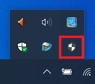
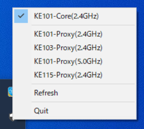

# proch

`proxychange` makes it easy to switch a wireless LAN and its proxy settings for Windows 10.

It's developed using [`systray`](https://github.com/getlantern/systray).

<a href="./doc/README_ja.md">README(日本語)</a>

## How to Build

Download the latest `proch.exe` binary file from [Releases](https://github.com/Riki-Okunishi/proch/releases).

If you have already installed the Go language, you can build it yourself without downloading the binary file.

```bash
go install -ldflags -H=windowsgui github.com/Riki-Okunishi/proch/cmd/proch@latest
```

## Get Started

1. Create `setting.json` shown below. You list up your wireless network and proxy settings in this file.
   If the value of "proxyEnable" is true for a given network, then you should specify the values of "proxyServer" and "proxyOverride".

```json: setting.json
{
  "profiles": [
    {
      "ssid": "Proxy SSID",
      "proxyEnable": true,
      "proxyServer": "proxy.address:PORT",
      "proxyOverride": "excluded address[;<local>]"
    },
    {
      "ssid": "non-Proxy SSID",
      "proxyEnable": false
    }
  ]
}
```

> Note: `;<local>` is optional in `"proxyOverride"`. `;` is a separator of excluded IP addresses, `<local>` is the option to check "Don't use any proxy server for addresses in intra(local) network".

2. Put the `setting.json` file in the same directory as `proch.exe`. You can put them in any directory.
   `proch.exe` is installed in `%USERPROFILE%/go/bin` if you build with `go install`.

```
your-directory/
├── proch.exe
└── setting.json
```

3. Double-click `proch.exe` or open that directory in a terminal and run the `proch` command (if `%USERPROFILE%/go/bin` has been added to Path). If you have changed the location of `setting.json` as described below, you can call it from any directory in the terminal.

## Usage

+ Where is `proch` running
  
  `proch` runs in the task tray. Click the icon to show wireless LAN SSID listed up in `setting.json`.

    

  When the mouse cursol is hover on this `proch` icon, it shows whether the proxy settings is `Enable` or `Disable` in connecting network.

    

+ How to switch SSID and proxy setting
  
  Click `proch` icon to select SSID. Proxy network and non-Proxy networks are separated in the list.

    
  
  Click the SSID to connect then the SSID and the proxy settings will be switched. Connecting SSID is checked.

    

+ Refresh the current SSID and the proxy settings

  Click `Refresh` button, `proch` will reload the current SSID and its proxy settings.

+ Exit

  Click the Quit button to exit `proch.exe`.

## How to change `setting.json` location

You can change the path of `setting.json` instead of the same directory as `proch` by adding/editing the registry key.

1. Open "Registry Editor" (required administrator permission).
2. Create the registry key `HKEY_LOCAL_MACHINE\SOFTWARE\Proch\SettingJson`.
3. Add the value to this key as "string value(REG_SZ)" and set the data to the directory path where you want to place the `setting.json` file.

If the registry key is not registered or the data of the key is invalid, it will be assumed to be located in the directory where you ran `proch`.

## Add to startup

If you want `proch` to be up when your computer has started up, you need to register `proch.exe` as a startup programs.

1. Open "File Explorer".
2. Input `shell:startup` to address bar. This will open "Startup" folder.
3. Create a shortcut to `proch.exe` in the this folder.

##  License
MIT License
