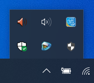
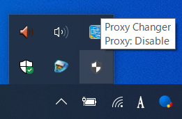
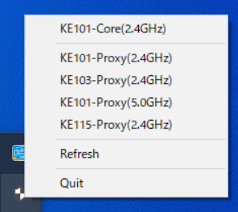
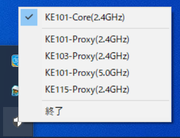

# proch

`proxychange` は無線LANでのプロキシ設定を簡単に切り替えるWindows 10向けツールです。

このプログラムは、[`systray`](https://github.com/getlantern/systray)を使って開発されています。

## ビルド方法

もしGo言語をインストール済みであれば、GitHubのReleaseページからバイナリをダウンロードせずに自分でビルドできます。

```bash
go install -ldflags -H=windowsgui github.com/Riki-Okunishi/proch/cmd/proch@latest
```

## 導入方法

1. 以下のような `setting.json` ファイルを作成してください。このファイルに「このツールで切り替えたい無線LANのSSID」と「そのプロキシの設定」を記載します。
   もし `"proxyEnable"` の項目を `true` と記載した場合、`"proxyServer"` と `"proxyOverride"` の項目も記載するようにしてください。

```json: setting.json
{
  "profiles": [
    {
      "ssid": "Proxyを使用するSSID",
      "proxyEnable": true,
      "proxyServer": "プロキシサーバのアドレス:ポート番号",
      "proxyOverride": "除外するIPアドレス[;<local>]"
    },
    {
      "ssid": "プロキシを使用しないSSID",
      "proxyEnable": false
    }
  ]
}
```

> Note: `"proxyOverride"` での `;<local>` の部分は任意です。列挙する場合の区切り文字が `;` で、『ローカル(イントラネット)のアドレスにはプロキシ サーバーを使わない』のチェックボックにチェックを入れるオプションが `<local>` です。

2. 作成した `setting.json` ファイルを `proch.exe` と同じディレクトリに配置してください(配置する場所は自由です)。
   `go install` コマンドを使ってインストールした場合は、`proch.exe` は `%USERPROFILE%/go/bin` に配置されています。
3. 実行するには、`proch.exe` をダブルクリックするか、そのディレクトリをターミナルで `proch` と入力してEnter(`%USERPROFILE%/go/bin`にPathが通っている場合)です。後述する `setting.json` の配置場所変更を行った場合、ターミナルではどこからでも呼び出せます。

## 使い方

+ `proch` の実行場所
  
  `proch` はタスクトレイに常駐します。アイコンをクリックすると、`setting.json`に記載した無線LANのSSIDが一覧で表示されます。

    

  `proch` のアイコンにマウスカーソルをホバーすると、現在のプロキシ設定が有効( `Enable` )なのか無効( `Disable` ) なのか表示されます。

    

+ SSIDとプロキシ設定の切り替え方
  
  `proch` のアイコンをクリックしてSSID一覧を表示します。プロキシ有りのネットワークとプロキシ無しのネットワークは分けて表示されます。

    

+ 接続したいSSIDをクリックすると、そのSSIDで接続しプロキシ設定が切り替わります。接続中のSSIDはチェックされた状態になります。

    


## `setting.json`ファイルの配置場所変更

`setting.json` ファイルの配置場所を「 `proch.exe` と同じディレクトリ」以外に変更することができます。

ただし、レジストリキーの変更を伴うので、自己責任で行ってください。

1. レジストリエディターを開きます。
2. キー `HKEY_LOCAL_MACHINE\SOFTWARE\Proch\SettingJson` を作成します。
3. このキーに値を「文字列値(REG_SZ)」として追加し、データを `setting.json` ファイルを配置したいディレクトリにパスに設定します。

もしレジストリキーが登録されていなかったり、キーのデータが無効だったりする場合、設定しない場合と同様に `proch.exe` を実行したディレクトリに `setting.json` が配置されているか確認されます。


## スタートアップへの追加

もしPCの起動と同時にこのアプリを起動させたい場合は、このプログラムをスタートアップとして登録する必要があります。

1. エクスプローラーを開きます。
2. エクスプローラーのアドレスバーに `shell:startup` と入力してEnterすると、「スタートアップ」フォルダが開きます。
3. このフォルダに `proch.exe` のショートカットを配置します。

##  License
MIT License
